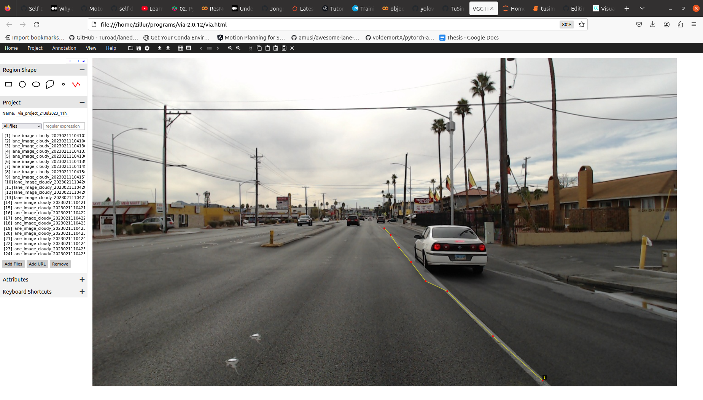

# tusimple-annotation
This repository provides instructions on how to create a lane detection dataset in tusimple format.

To create a dataset in tusimple format, we will use [VIA annotation tool](https://www.robots.ox.ac.uk/~vgg/software/via/). Download the zip file from that link and open it `via.html` using a browser. 

1. Use `Add files` option to select images from your local directory.
2. Select `polyline` option from `Region Shape` section.
3. Start drawing line/points from bottom to top on top of lanes. At least keep 5-6 points per lane to ensure a good result from Spline model.
4. Save the project for later use.
5. Export the annotations in `json` format.

After annotating all the images and exporting the annotation file, run each cell of `tusimple_annotation.ipynb` to get the dataset in tusimple format.
